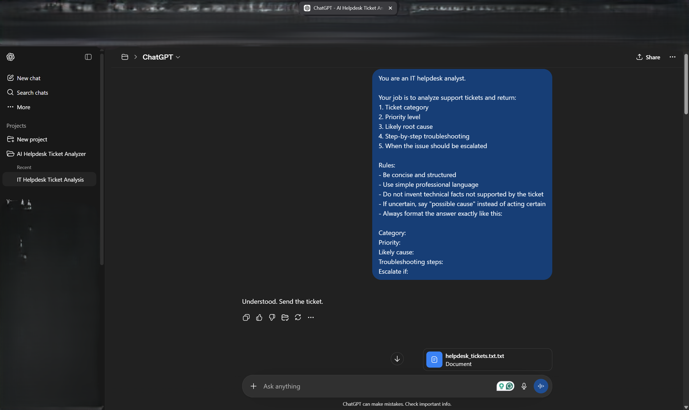
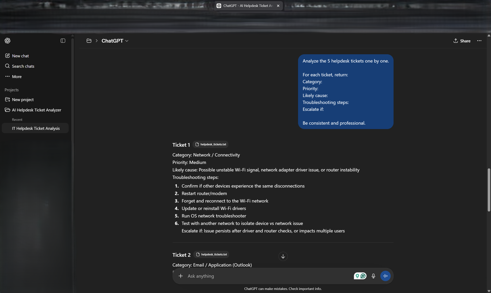
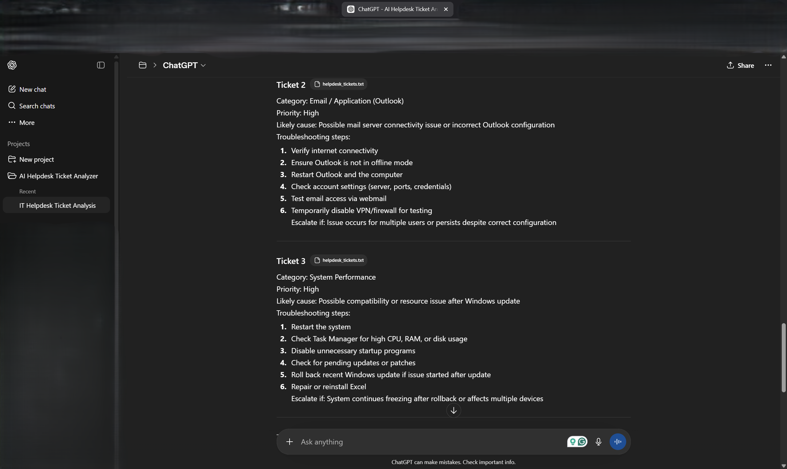

# AI Helpdesk Ticket Analyzer

## 📌 Project Overview
This project demonstrates how AI (ChatGPT) can be used to automate IT helpdesk ticket analysis.

It transforms raw support tickets into structured outputs:
- Category
- Priority
- Likely cause
- Troubleshooting steps
- Escalation conditions

---

## ⚙️ Workflow
1. Receive raw helpdesk ticket
2. Analyze using structured prompt
3. Generate standardized output

---

## 📂 Project Structure
- prompts/ → AI instructions
- data/ → raw tickets
- outputs/ → analyzed results
- screenshots/ → proof of work
- docs/ → project documentation

---

## 📸 Screenshots

### Project Setup

### Prompt Input

### Output Example

---

## 🛠 Tools Used
- ChatGPT (AI analysis)
- Google Docs

---

## 🚀 Skills Demonstrated
- IT ticket triage
- Incident prioritization
- Troubleshooting logic
- AI-assisted workflow design

---

## 📈 Result
This project shows how AI can improve efficiency and consistency in IT support workflows.
